1. First loging to the with your DBADMIN to your HANA DB EXplorer then go to the instance ---> overview ---> users 
    see the below photo

    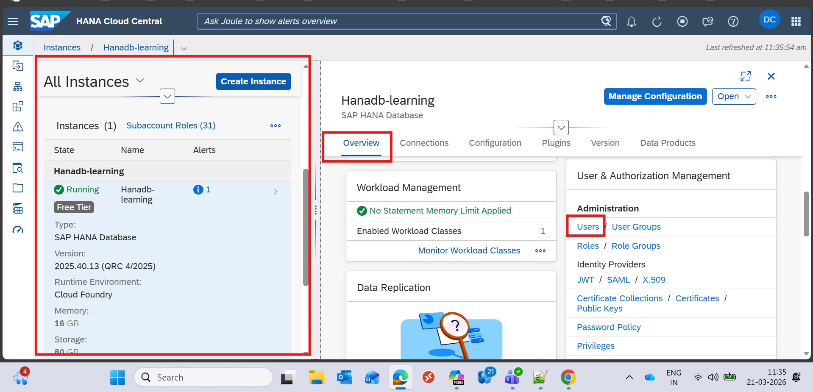
    
2. then first create a user (because you can't assign your self the debugger role)

    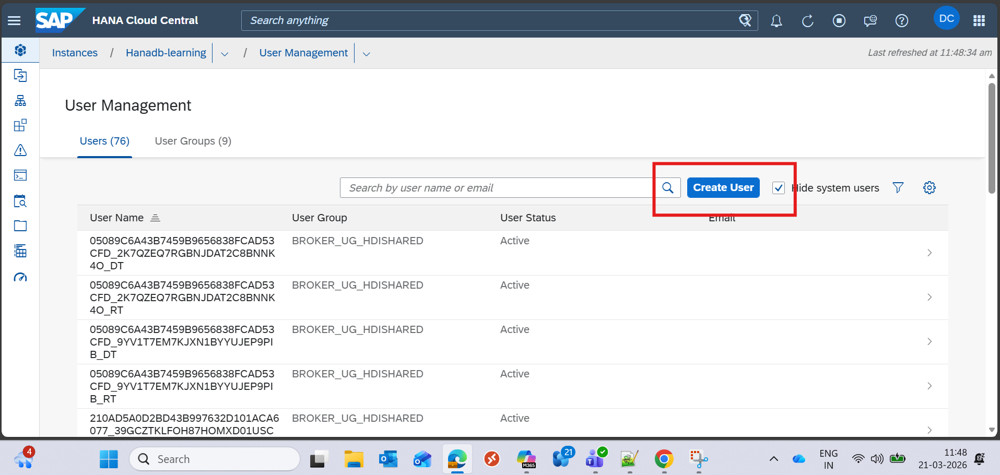

3. then logged in using the user you just created and for the first time it will ask for the password reset , reset the passwrod accordingly

    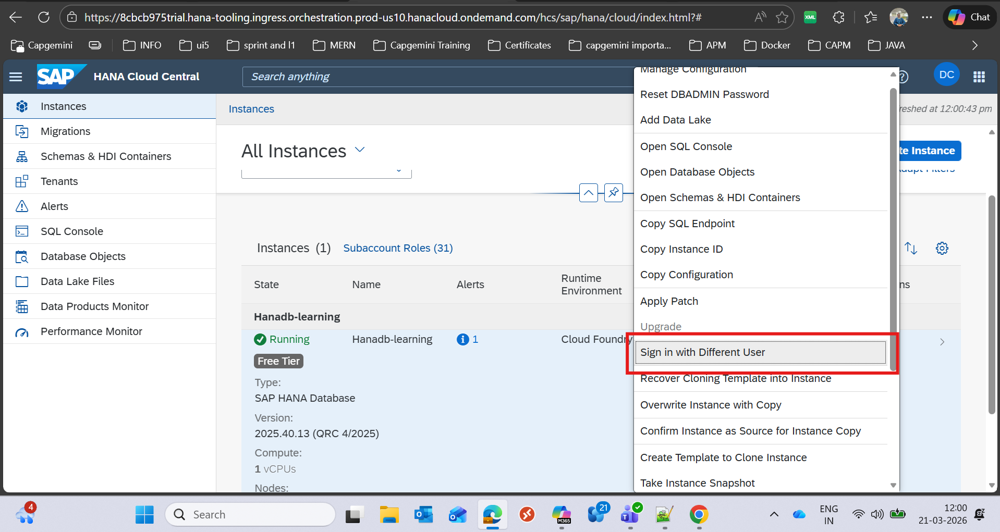

4. search the user you want to attach debugger role (but other than the logged in user)

    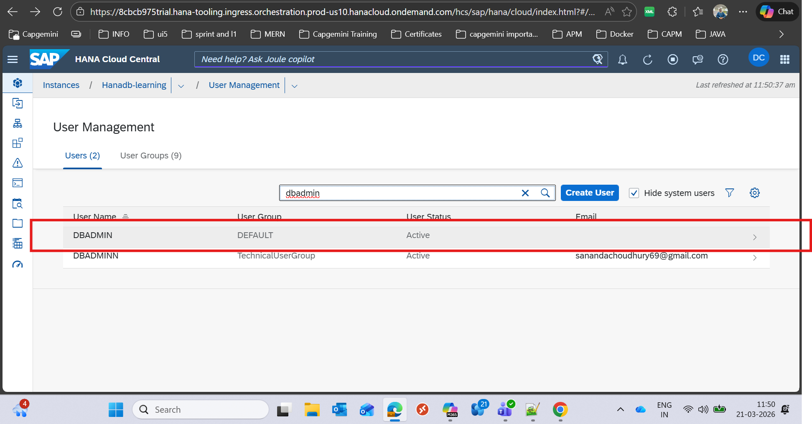

5. then select the privilage assginment.
    
    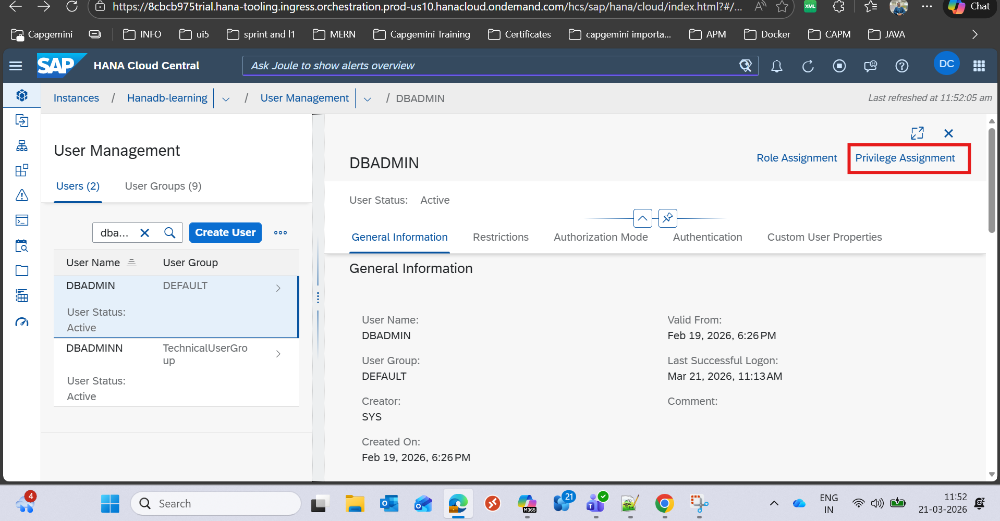

6. then click on the edit privilage on user then click on add and assign attach debugger privilage. and then click on save.

    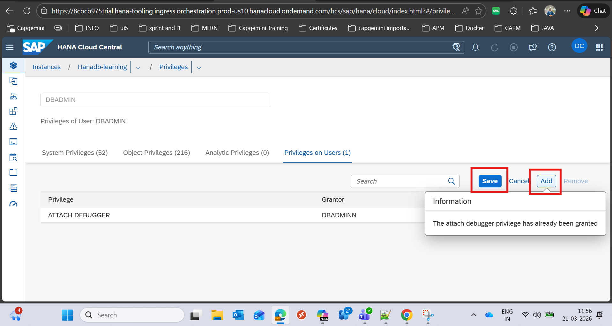

7. then open the hana db explorer chooose the procedure of the db you want to debug then on the correct procedure right click and slecet  >>> open for debugging.

    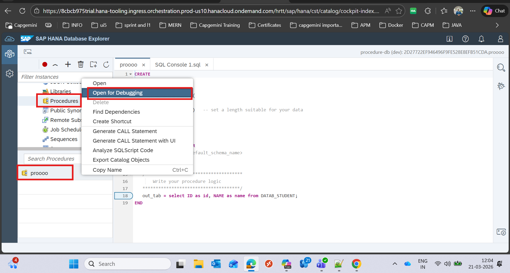

8. then click on the connection icon and select a perticular db in which you want to debug.

    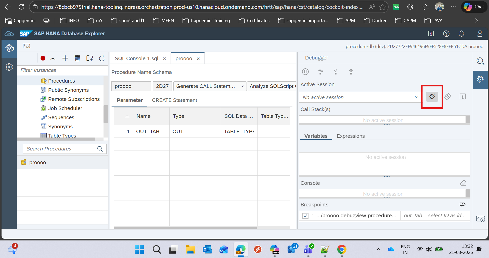

    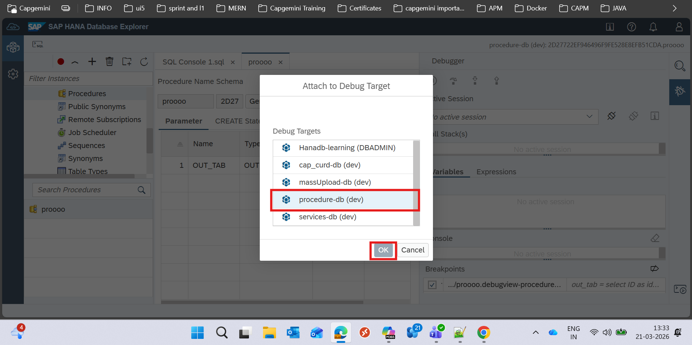
    
9. now select below configuration and click on ok

    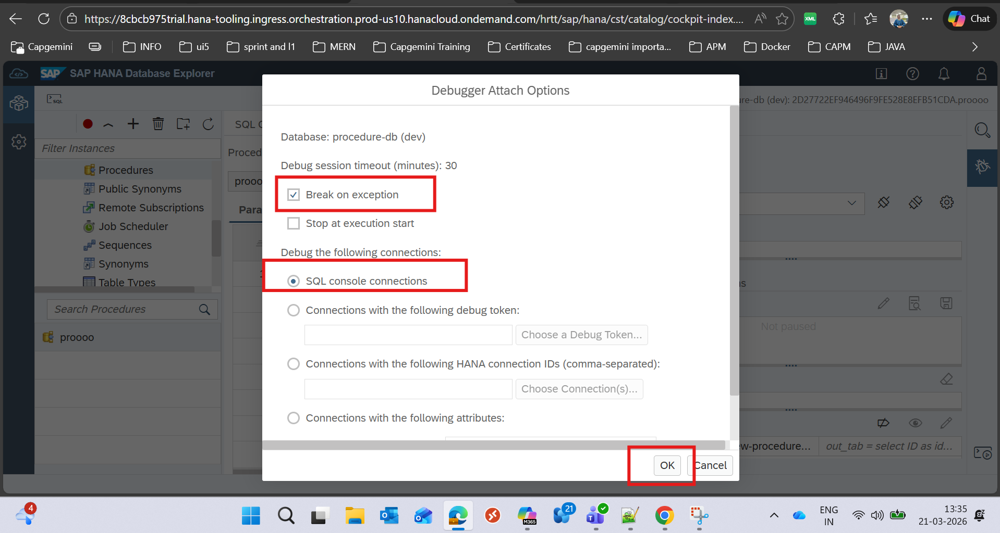

10. then you can see the connection established and we can now put a debugger breakpoint over there. and we can see there in the breakpoint section

    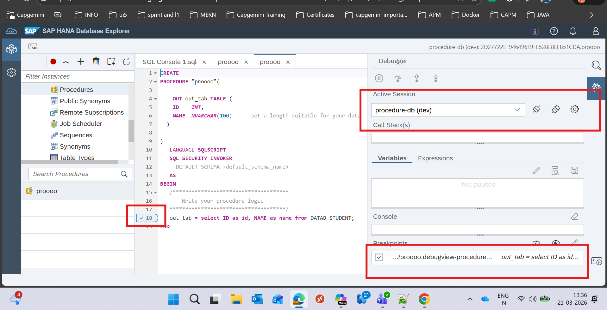

11. now for testing the debugger we can run it from the code level in hybrid mode of the application (cds watch --profile hybrid) or you can just generate a call statement and run that.

    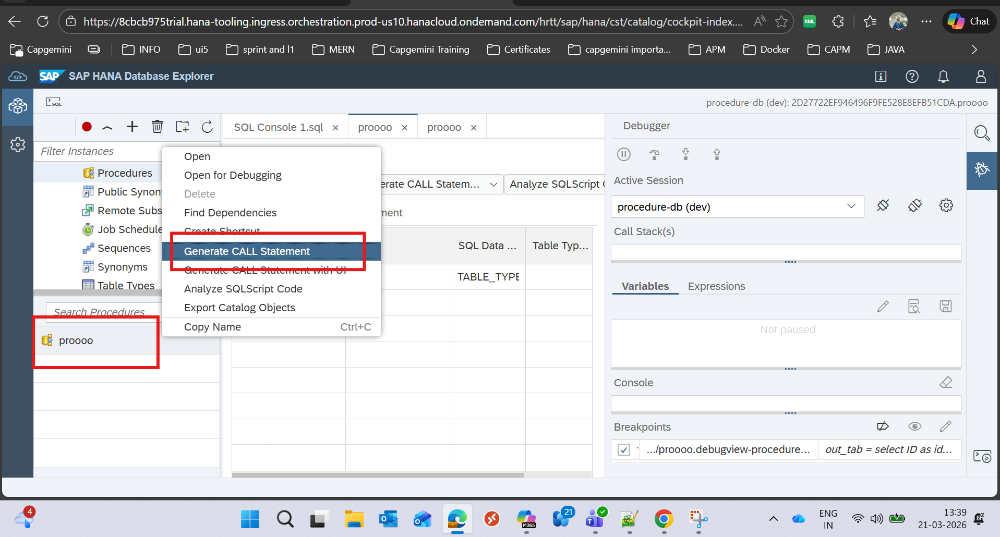

    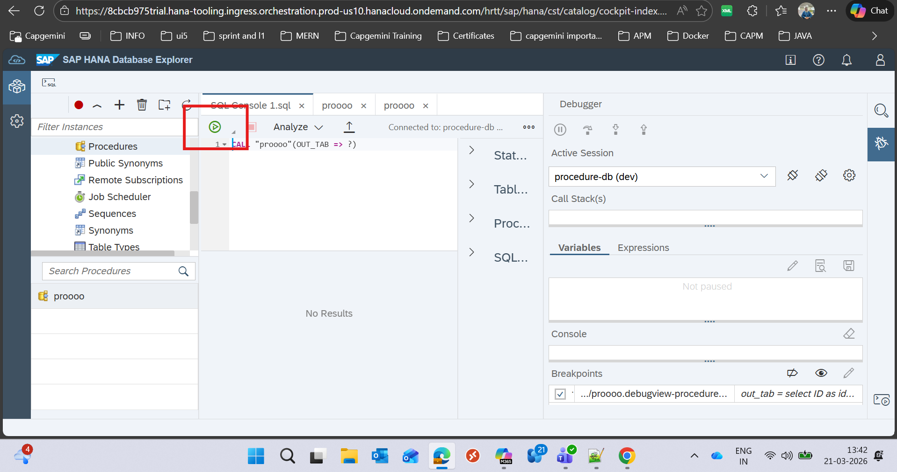

12. now for debugging we can follow some technical things. (to track any variable and expression we need to check on these 2 sections )

    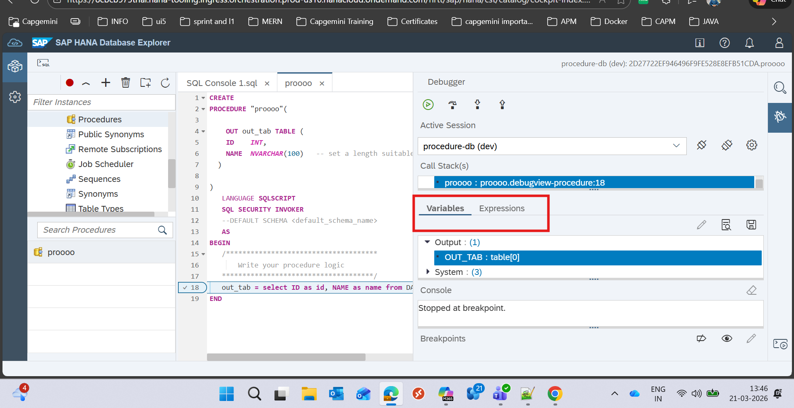

    in the variable tab you can select the variable and click on this icon you can find the details

    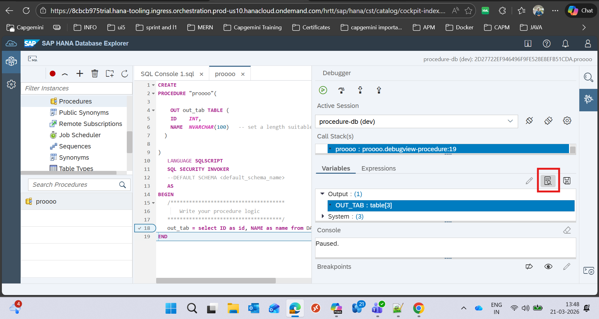

    and you can write you sql expression while debugging so that you can debug properly.
    to do that you need to go to the EXPRESSION tab and click on the + icon and create your statement with a name and save it

    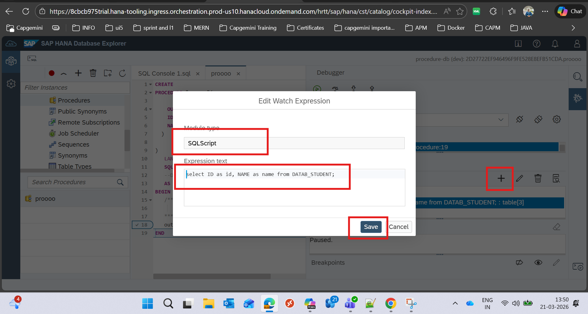

    now you can see it under sql script name section and to see the details you need to slelect the statement and click on that icon to see the Result of the statement.

    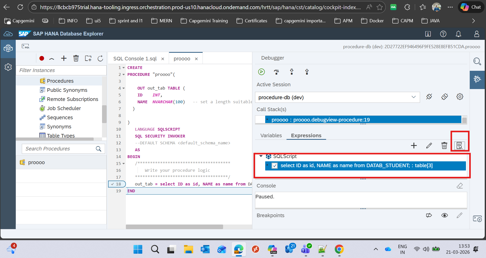

    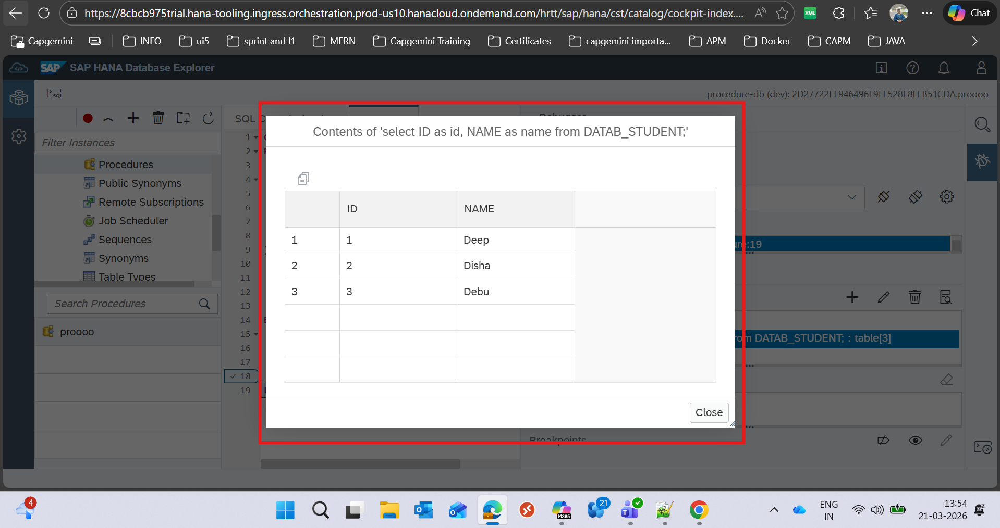

    

