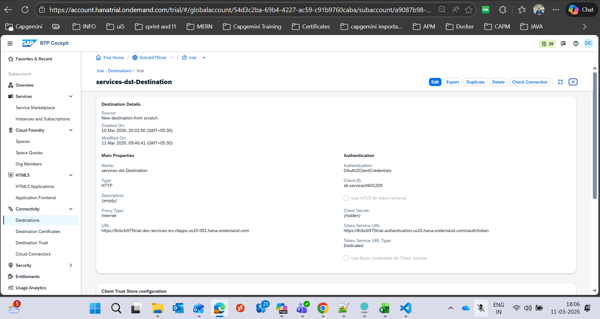
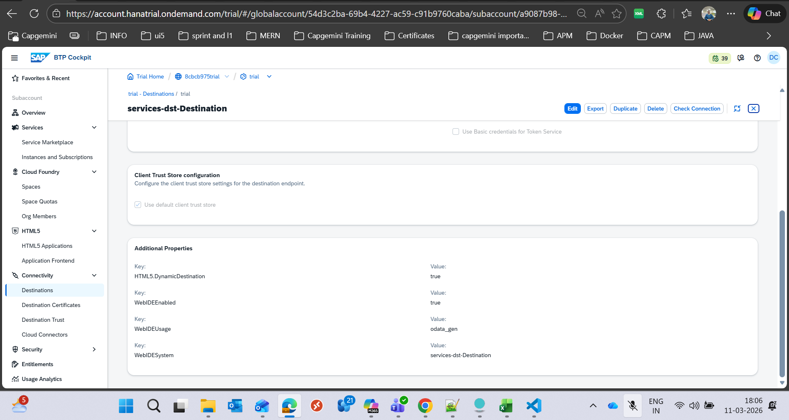
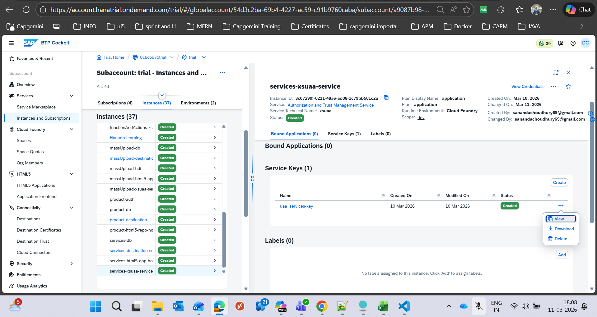
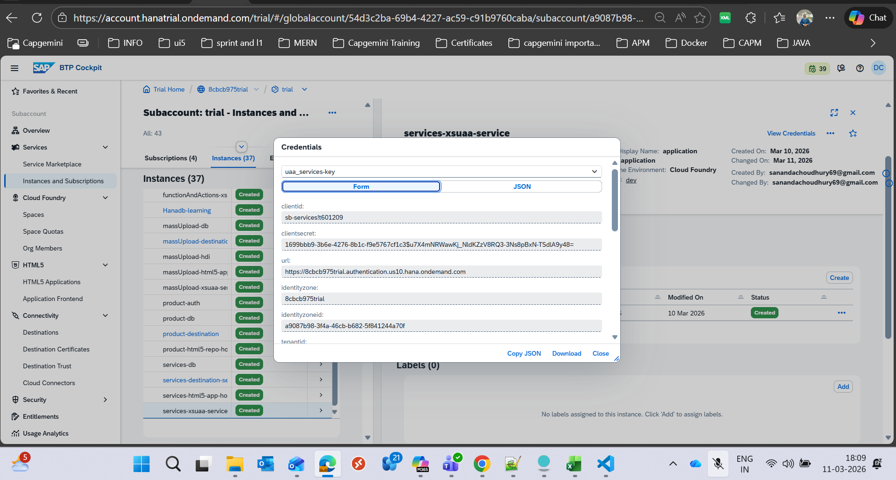

Key
    HTML5.DynamicDestination
Value
    true

Key
    WebIDEEnabled
Value
    true

Key
    WebIDEUsage
Value
    odata_gen

Key
    WebIDESystem
Value
    services-dst-Destination

    

    

    now we we might ask where the client details will come from-->

    

    then

    