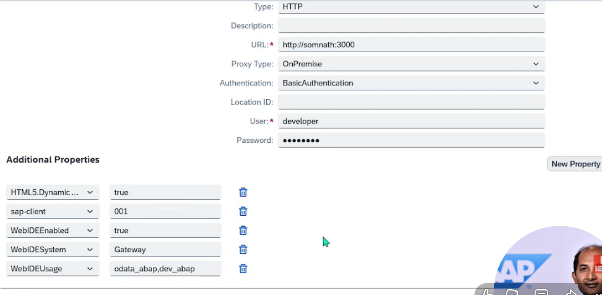

create a .env file in the root of the folder

destinations=[{"name":"Ducati_ECC_CC_ODATA_clone","proxyHost":"http://127.0.0.1","proxyPort":"8887","url":"http://Ducati_ECC_CC_ODATA_clone.dest"}]

create a private .cdrs-private.json file and paste the following

    {
  "requires": {
    "db": {
      "kind": "hana",
      "credentials": {
        "user": "<user>",
        "password": "<HDI_PASSWORD>",
        "host": "<host>",
        "port": "443",
        "schema": "<Schema>",
        "certificate": "-----BEGIN CERTIFICATE-----\nMIIDrz...\n-----END CERTIFICATE-----"
      }
    },
    "[hybrid]": {
      "destinations": {
        "binding": {
          "type": "cf",
          "apiEndpoint": "<api end point>",
          "org": "<cf_org>",
          "space": "<space name>",
          "instance": "<destination_connection_instance>",
          "key": "key"
        },
        "kind": "destinations",
        "vcap": {
          "name": "destinations"
        }
      },
      "connectivity": {
        "binding": {
          "type": "cf",
          "apiEndpoint": "https://api.cf.eu10-004.hana.ondemand.com",
          "org": "<organization>",
          "space": "<space_name>",
          "instance": "<Connectivity_instance>",
          "key": "key"
        },
        "kind": "connectivity",
        "vcap": {
          "name": "connectivity"
        }
      }
    }
  }
}

https://me.sap.com/notes/3112360/E

https://www.youtube.com/watch?v=jTzkogE_Wm0

https://me.sap.com/notes/3112360

3112360_E_20260423.pdf  -----> follow this file in the same folder

1. Create a cloud connector
2. create a destination

3. download the edmx file 
4. do
        cds import <file.edmx>
        it will create a src/evternal/<filename.cns> file
5. configure your pckage.json properly

        "employeedata": {
				"kind": "odata",
				"model": "srv/external/employeedata",
				"credentials": {
					"destination": "empmanagement-destination-dest",
					"requestTimeout": 30000000,
                    "path" : "/sap/opu/odata/......" (if anything you want like this)
				}
			},

6. add service defination and custom handler.

        const connection = await cds.connect.to("<Destination Name>");
        const tx = connection.tx(req);
        const result = tx.run(req.query);
        return result;

7. now while getting the data if any error then install the dependencies told in the vieo on 15:00

8. now at the last you will get failed to load the destination.

9. login to cloud foundry with correct account and space

10. then you need to create some service instance through BTP or BAS CMD

        1. Destination Service creation

            cf cs destination lite <any_name>                ----->  cf cs destination lite employeedata_dest
            cf csk <service_name> <put_any_name_as_key_name> ----->  cf csk employeedata_dest srv_key

        2. Connectivity Service creation

            cf cs connectivity lite <any_name>                ----->  cf cs destination lite employeedata_conn
            cf csk <service_name> <put_any_name_as_key_name> ----->  cf csk employeedata_conn srv_key

11. bind the destination and connectivity services to the application

            cds bind --to <destination_service_name>:<service_key>

            cds bind --to <connectivity_service_name>:<service_key>

12. then you will get a ECONNRESET error

to fix that we need to follow this document: 
            
            https://me.sap.com/servicessupport/search/%7B%22q%22%3A%22ECONNRESET%22%2C%22tab%22%3A%22All%22%7D
            https://me.sap.com/notes/3112360
            https://me.sap.com/notes/0003112360
            https://community.sap.com/t5/technology-q-a/cap-consuming-on-premise-odata-service-read-econnreset-error/qaq-p/12798032

            3112360_E_20260423.pdf ---> follow this file in the folder

13. create a .env file and paste the below content

    destinations=[{"name":"<destination_name>","proxyHost":"http://127.0.0.1","proxyPort":"8887","url":"http://<destination_name>.dest"}]

    for destination name reference
    =======================================================================

        "cds": {
            ...
            "backend_odata": {
                "kind": "odata-v2",
                "model": "srv/external/backend_odata",
                "credentials": {
                "destination": "<destination_name>"
                }
            }
            }
        }

    ========================================================================

14. Run the below command in the terminal and then run the server again

    curl http://localhost:8887/reload

