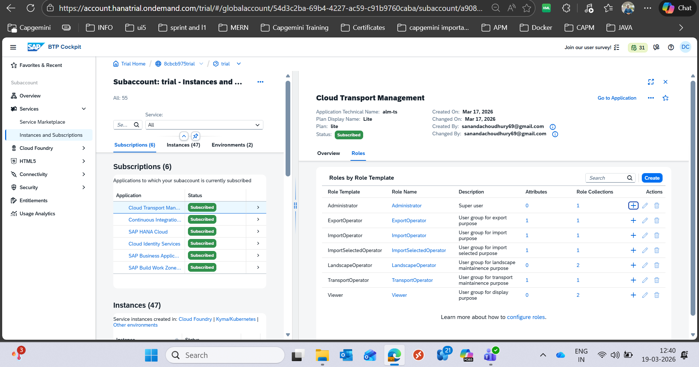

FOllow this video----->
                        https://www.youtube.com/watch?v=r_xUsCiZUiY
                        -----> open shilpa di's shared btp 2024 document then go to the 
                                27th video and follow that.

1. first follow the cicd document.
2. create the service of CTMS (both subscription and instance) and assign the roles and most important ***********
            ----> first create a roll collection
            ----> then open the ctms service
                    
            ====> by clicking on the + icon add every role to the roll collection.
            -----> then assign the role collection the the user
            -----> then follow the video for other details.
            

